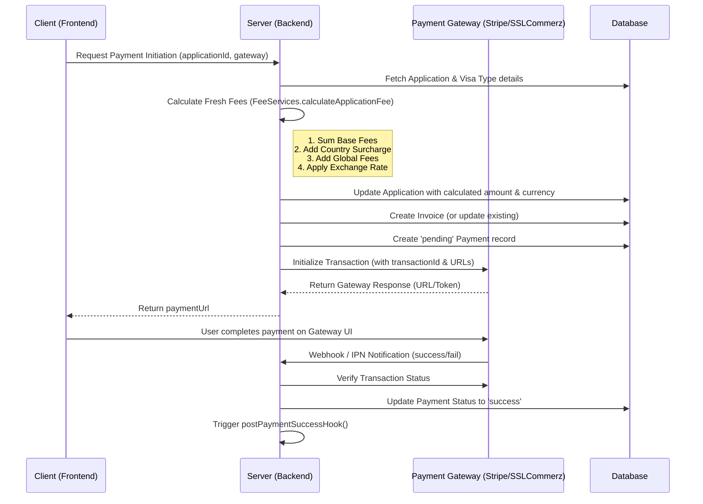

# Visa Application Payment & Fee Management Flow

This document provides a comprehensive overview of how fees are calculated, how currency is identified, and how the entire payment lifecycle is managed within the system.

## 1. Fee Calculation Logic
The fee for a visa application is not a single static number. It is dynamically calculated by the `FeeServices.calculateApplicationFee` function using multiple components:

### A. Base Fees (from Visa Type)
Each visa category (e.g., Tourist, Business, Student) has set fees defined in the **VisaType** model:
- **Base Visa Fee**: Standard cost for the visa.
- **Biometric Fee**: Specifically for biometric data collection.
- **Service Fee**: The agency's processing/service charge.

### B. Country Surcharge & Currency Rules (from TransitCountry)
The system looks at the applicant's country (from the application form data) and applies settings from the **TransitCountry** model:
- **Surcharge**: Some countries have specific additional costs.
- **Currency Identification**: If the country has a specific currency defined (e.g., 'USD' or 'EUR'), the system will use that. If not, it defaults to the currency specified in the Visa Type or 'AUD'.
- **Exchange Rate**: If an exchange rate is defined for that country (against AUD), it is applied to the **total sum** of all fees.

### C. Global Fee Settings (from FeeSetting)
These are administrative toggles that apply based on application properties or status:
- **Document Processing Fee**: Applied per document uploaded (e.g., $10 per document).
- **Agency Consultation Fee**: A global flat fee (if active).
- **Express/Urgent Fee**: Applied if `isUrgent` is checked in the form.
- **Passport Courier Fee**: Applied if `needsCourier` is checked.

---

## 2. The Payment Workflow

---

## 3. Currency Identification Flow
How does the system decide which currency to charge?

1.  **Check Applicant Country**: It identifies the country selected in the application form (`formData.country`).
2.  **Lookup TransitCountry**: It searches the database for a matching `TransitCountry`.
3.  **Prioritize Currency**:
    -   If `TransitCountry` has a currency (e.g., 'USD'), use it.
    -   Else if `VisaType` has a currency (e.g., 'AUD'), use it.
    -   Else default to 'AUD'.
4.  **Apply Conversion**: The system calculates everything in base rates (usually AUD) first, then multiplies the **entire subtotal** by the `exchangeRate` defined for that specific country.

---

## 4. Post-Payment Actions
Once a payment is verified as successful, the `postPaymentSuccessHook` performs several critical tasks:

1.  **Mark Application**: Updates `VisaApplication.status` to `PAID`.
2.  **Finalize Invoice**: Updates `Invoice.status` to `paid` and records the exact time.
3.  **Generate Summary**: creates a professional **PDF report** of the application data.
4.  **Send Confirmation**: Sends an email to the Agent (who submitted it) or the Applicant directly with the receipt and PDF attached.

---

## 5. Security & Auditing
- **No Client Trust**: The server **re-calculates** fees every time before initiation. It never trusts the price sent from the frontend.
- **Transaction Logs**: Every step (Initiation, Webhook, Success, Failure) is recorded in `PaymentLog` for auditing and troubleshooting.
- **Idempotency**: Webhooks are checked to ensure a payment isn't processed twice for the same transaction ID.
